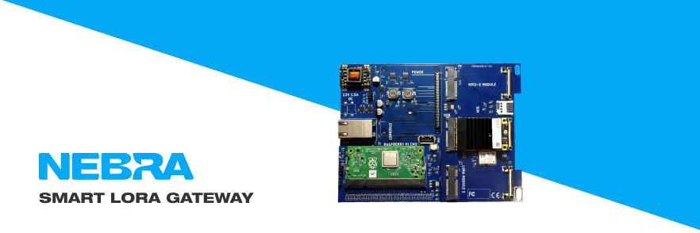
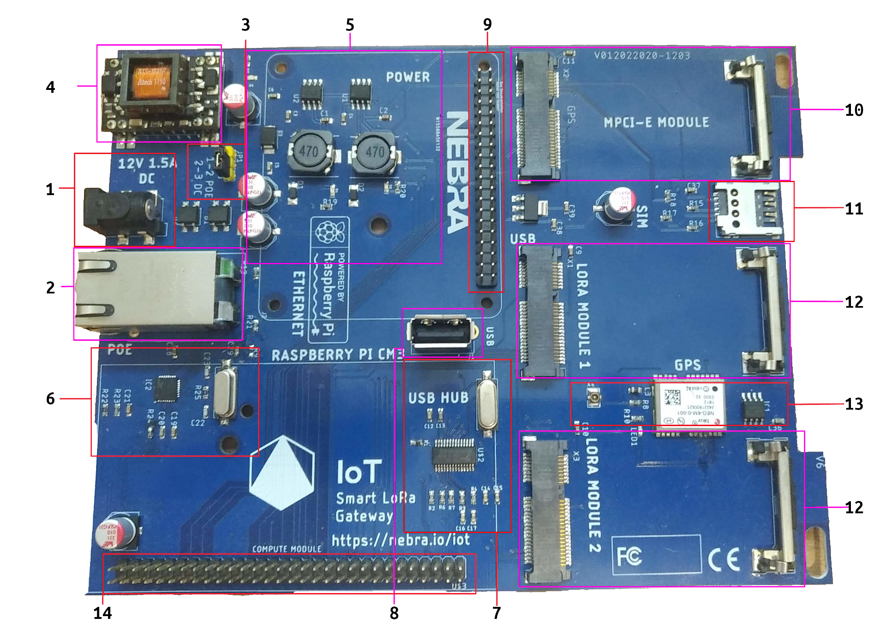

# Nebra Smart LoRa Gateway Manual

Last Updated 19th October 2020

### Disclaimers
Copyright (C) 2020 Nebra LTD.
Changes to the specifications and features in this manual may be made by Nebra without prior notice.

Specifications and information provided in this maual are for informational use only. Nebra LTD. assumes no responsibility or liability for any errors or inaccuracies that may appear in this manual including the product & / or software.

All trademarks mentioned in this manual are property of their respective owners.

This product contains copyrighted software which are released under multiple open source licenses including but not limited to the GNU GPL, LGPL, and MIT BSD licenses. Such software is provided without warranty. Copies of these licenses are included in the software itself in further detail.

For the latest up to date information, please visit our Github Repository at https://github.com/NebraLtd/Smart-LoRa-Gateway/

## Contents

## Chapter 1 - Hardware Overview

### 1.0 Safety Precautions
Before proceeding please do the following:

* When handling the equipment, take appropriate ESD measures including using a grounding strap or a safely grounded object to avoid damage from static electricity.
* Hold all modules by the edges and avoid touching any components on them.
* If you remove a module place it into the anti-static bag that came with the hardware.
* Before installing or removing any modules or part of the hardware, ensure that any power has been switched off and disconnected including the Ethernet cable if powered via POE.
* If the Gateway is located outside, that it is not Raining, Snowing or any other adverse weather that may cause damage when opening.

### 1.1 Mainboard Overview

#### 1.1.2 Mainboard Layout

##### 1.1.2.1 Layout Contents

1. DC Barrel Jack - 2MM Pin, 6.5MM Barrel centre positive. Recommended PSU 12V @1.5A.
2. LAN Connector - RJ45 Connector wired to the Ethernet & POE Modules.
3. Power Jumper - 3 Pin jumper to select power source, place in position 1-2 for POE, or 2-3 for DC Jack.
4. POE Module - Negotiates 802.11AF compliant connection and outputs 12V DC into the power section.
5. Power Section - Takes the 12V power source and regulates it down to 5V & 3V3 rails.
6. Ethernet Controller - 10/100 Ethernet to USB 2.0 Adaptor, Maxlinear XR22800IL32-F. Connected to USB Hub.
7. USB Hub - 4 Port USB Hub, wired to Ethernet controller, USB port & M-PCIE connector.
8. USB Port - USB 2.0 Type A Connector, recommended max power 250mA.
9. "Raspberry Pi" Header - 40 Pin RPi style header, please note only the first 24 pins are wired. (Refer to 1.1.X)
10. M-PCIE connector - M-PCIE Connector wired up to USB for connectivity, has Micro SIM Card connected to it.
11. Micro Sim Card Slot - For use with 3G/4G Module in M-PCIE slot
12. Lora Module Connector - Designed for use with select M-PCIE LoRa Concentrators, these only have wired up SPI, plus GPS PPS from the GPS Module.
13. GPS Module - NEO-6M GPS module, connected to UART1 on the compute module. Plus PPS signal to LoRa modules for accurate timings.
14. Daughterboard Connector - Connects to Compute Module Daughterboard.

##### 1.1.2.2 Status LEDS
The mainboard has 3 Status LEDs which do the following:
* 12V LED - Indicates the mainboard has power located near the jumper.
* 5V LED - Indicates the 5V regulator is operational located in the power section.
* 3V3 LED - Indicates the 3V3 regulator is operational located in the power section.

### 1.2 Daugherboard Overview

#### 1.2.1 Daughterboard (CM3) Overview
The standard daughterboard supports the Compute Module 3, Compute Module 3+ and Lite Variants.

While also compatible with the CM1 we recommend using the CM3 Lite or CM3+ / CM3 Lite for storage sizes.

##### 1.2.1.1 Layout Contents
1. Daughterboard Connector - Connects to the Mainboard.
2. SO-DIMM connector - Raspberry Pi Compute Module connects here.
3. Power Regulator - Power Circuitry required for the compute module.
4. SD Card Slot - SD Card Slot for if a CM3/CM3+ Lite is used.
5. Micro USB Connector - Used to re-flash the EMMC on the Compute Module.
6. USB Switch - IC responsible to allow switching between Micro USB and Mainboard.
7. USB Jumper - Used to switch between normal operation and flash mode, ensure it is in position 1-2 for normal operation and 2-3 for programming.
8. Power Jumper - Allows the module to be powered from the Micro USB connector. Only connect when programming from PC and ensure mainboard is not connected.

##### 1.2.1.2 Status LEDS
The board has 2 Status LEDs which do the following:
* Power LED - Indicates the board has power. (Blue)
* ACT LED - Indicates Read / Write operations on the storage. (Green)

#### 1.2.2 Daugherboard (CM4) Overview
This section is reserved for potential future use, however currently there is no plans to make a CM4 compatible daughterboard due to power and thermal constraints.

#### 1.2.3 Storage Selection
There is multiple choices of storage selection you can choose, we are still confirming the media we plan to ship with as standard, currently it is most likely an SD Card.

We recommend that on the CM3 that the Lite variant is used with an SD card so that the storage size is at least 8GB, if EMMC is used we recommend the CM3+ 8GB Variant.

##### 1.2.3.1 EMMC storage
Depending on the Compute Module 3+ used you can have up to 32GB of EMMC storage onboard. EMMC storage has the advantage of being soldered onto the board, however is a longer process to re-flash and if damaged is not user replaceable.

The Daughterboard contains the USB Circuitry to allow the EMMC to be flashed via USB using the correct tools to boot the Compute Module into programming mode.

##### 1.2.3.2 SD Card
The Compute Module 3+ Lite variant has no onboard storage so requires some form to boot from which would typically be an SD card.

We highly recommend a good quality Industrial rated SD card is used, these offer near EMMC reliability while providing the benefits of easier re-programming and replacement in case of failure.

In our testing the Sandisk Industrial cards last just as well as EMMC.

##### 1.2.3.3 Net Boot
The Compute Module 3+ Lite when on a correctly configured network can load all of it's files off a correctly configured server resulting in a gateway that doesn't have any internal storage for the highest reliability / maintenance.

##### 1.2.3.4 USB Boot
Finally the Compute Module 3+ Lite supports booting from USB, insert a suitable & correctly flashed USB drive into the USB Socket and it should boot from this if no SD card is inserted.

### 1.3 Module Pinouts

#### 1.3.1 M-PCIE Pinout

The M-PCIE Connector is connected to the USB HUB for data, and has connection to the SIM slot in the following configuration.

#### 1.3.2 "RPi Style" Header Pinout
The Raspberry Pi Header takes the form factor of the 40 Pin Raspberry Pi header however is not fully electrically compatible. Due to GPIO pins being used on other parts of the board.

Only the first 24 Pins are wired, but are then in the same pinout as the Raspberry Pi header. The pinout is as follows.

| Pin#   | Name | Name | Pin#   |
| ----   | ---- | ---- | ----   |
|   1    | 3.3V     | 5V     |   2    |
|   3    | GPIO02     | 5V     |   4    |
|   5    | GPIO03     | GND     |   6    |
|   7    | GPIO04     | GPIO14     |   8    |
|   9    | GND     | GPIO15     |   10   |
|   11   | GPIO17     | GPIO18     |   12   |
|   13   | GPIO27     | GND     |   14   |
|   15   | GPIO22     | GPIO23     |   16   |
|   17   | 3.3V     | GPIO024     |   18   |
|   19   | GPIO10     | GND     |   20   |
|   21   | GPIO09     | GPIO25     |   22   |
|   23   | GPIO11     | GPIO08     |   24   |
|   25   | GND     | NC     |   26   |
|   27   | NC     | NC     |   28   |
|   29   | NC     | GND     |   30   |
|   31   | NC     | NC     |   32   |
|   33   | NC     | GND     |   34   |
|   35   | NC     | NC     |   36   |
|   37   | NC     | NC     |   38   |
|   39   | GND     | NC     |   40   |

NC - Not Connected.

A majority of add-ons will work with this header, we recommend you check the pinout of the add-on you wish to use on <https://pinout.xyz/>

#### 1.3.3 LoRa Module Pinout
The LoRa Module Pinout takes the mechanical form factor of a M-PCIE module however is not electrically compatible, instead it is designed in the Pinout to be compatible with the following LoRa Modules:
* RAK833/SPI
* RAK2247/SPI
It is not compatible with the USB variant.

The electrical pinout is as follows:

| Pin#   | Name | Name | Pin#   |
| ----   | ---- | ---- | ----   |
|   1    | NC    | 3V3     |   2    |
|   3    | NC     | GND     |   4    |
|   5    | NC     | NC     |   6    |
|   7    | NC     | NC     |   8    |
|   9    | GND     | NC     |   10   |
|   11   | NC     | NC     |   12   |
|   13   | NC     | NC     |   14   |
|   15   | GND     | NC     |   16   |
|   17   | GND     | GND     |   18   |
|   19   | GPS_PPS     | NC     |   20   |
|   21   | GND     | Reset     |   22   |
|   23   | NC     | 3V3     |   24   |
|   25   | NC     | GND     |   26   |
|   27   | GND     | NC     |   28   |
|   29   | GND     | NC     |   30   |
|   31   | NC     | NC     |   32   |
|   33   | NC     | GND     |   34   |
|   35   | GND     | NC     |   36   |
|   37   | GND     | NC     |   38   |
|   39   | 3V3     | GND     |   40   |
|   41   | 3V3     | NC     |   42   |
|   43   | GND     | NC     |   44   |
|   45   | SPI_SCK     | NC     |   46   |
|   47   | SPI_MISO     | NC     |   48   |
|   49   | SPI_MOSI     | GND     |   50   |
|   51   | SPI_CS     | 3V3     |   52   |

NC - Not Connected.

The module in LoRa 1 is connected to the SPI1.0 bus, the module in LoRa 2 is connected to the SPI2.0 bus.
The module in LoRa 1 is reset via GPIO, and in LoRa 2 is reset via GPIO.
Both modules are connected to the GPS_PPS Signal provided by the on board GPS module.

#### 1.3.4 Daughterboard Connector Pinout
The Daughterboard connector is of our own specification, it allows us in the future to create new daughterboards for other SBCs.

The electrical pinout is as follows:

| Pin#   | Name | Name | Pin#   |
| ----   | ---- | ---- | ----   |
|   1    | 5V     | 5V     |   2    |
|   3    | GND     | GND     |   4    |
|   5    | USB-DM     | NC     |   6    |
|   7    | USB-DP     | NC     |   8    |
|   9    | NC    | NC     |   10   |
|   11   | NC     | RUN     |   12   |
|   13   | GPIO27     | GPIO26     |   14   |
|   15   | GPIO45     | GPIO25     |   16   |
|   17   | GPIO44   | GPIO024     |   18   |
|   19   | GPIO43     | GPIO023     |   20   |
|   21   | GPIO42     | GPIO22     |   22   |
|   23   | GPIO41     | GPIO21     |   24   |
|   25   | GPIO40     | GPIO20     |   26   |
|   27   | GPIO39     | GPIO19     |   28   |
|   29   | GPIO38     | GPIO18     |   30   |
|   31   | GPIO37     | GPIO17     |   32   |
|   33   | GPIO36     | GPIO16     |   34   |
|   35   | GPIO35     | GPIO15     |   36   |
|   37   | GPIO34     | GPIO14     |   38   |
|   39   | GPIO33     | GPIO13     |   40   |
|   41   | GPIO32     | GPIO12     |   42   |
|   43   | GPIO31     | GPIO11     |   44   |
|   45   | GPIO30     | GPIO10     |   46   |
|   47   | GPIO29     | GPIO9     |   48   |
|   49   | GPIO28     | GPIO8     |   50   |
|   51   | GPIO7     | GPIO6     |   52   |
|   53   | GPIO5     | GPIO4     |   54   |
|   55   | GPIO3     | GPIO2     |   56   |
|   57   | GPIO1     | GPIO0     |   58   |
|   59   | GND     | GND     |   60   |

##Chapter I Forgot - Flashing the Software

## Chapter 2 - Hardware Assembly
### 2.0 Preliminary Steps
##### For this you will require the following hardware:
* The Smart Gateway Mainboard
* The Smart Gateway CM Daughterboard
* A Raspberry Pi Compute Module
* Mounting Posts & Screws
* Either [M20 Cable Gland](https://uk.pi-supply.com/products/general-cable-passthrough-gland-m20-x-1-5) or [RJ45 Ethernet Passthrough Gland](https://uk.pi-supply.com/products/rj45-ethernet-passthrough-gland-m20-x-1-5 )
* [N Type to UFL](https://uk.pi-supply.com/products/ufl-ipex-to-n-type-bulkhead) Bulkhead per Antenna Required.

##### We also recommend the following tools:
* Phillips Screwdriver
* Spanner
* Spanner
* Self Grip Pliers / Locking Pliers

If you are planning to use a 3G/4G module we recommend for ease of installation that you insert the SIM Card into the SIM card slot before continuing as it's not easily accessible once mounted in the case.

### 2.1 IP67 Case Assembly
If not using in our IP67 case you can skip this step.

#### Step 1 - Mounting Posts

First screw in the 4, 15MM high mounting posts into the case into the highlighted positions.

#### Step 2 - Ethernet or Cable Gland
Next we need to screw in either the Ethernet or Pass through Cable Gland.

First remove the cover nut at the bottom middle position of the case with an M20 spanner.

Then get the cable gland and carefully screw it in hand tight and then finally with an M20 spanner tighten it 1/4 of a turn to ensure the washer seals the connection.

#### Step 3 - N Connector Bulkheads
For this stage you'll need an N Type Bulkhead for each antenna required, this varies on setups.

* LoRa Module - 1 Connector per module.
* Onboard GPS - 1 Connector required to use.
* 3G/4G - 2 Connectors required for typical operation, 3 for GNSS support.
* Wi-Fi - Internal antenna is used, external will require 1 connector.

A maximum of 5 antennas is supported however in most cases 1-3 will be used, you can arrange the antennas in a pattern you prefer, we recommend the connector opposite to the module for that connector.

Remove the cover nut for the selected antenna with an M spanner and then keep in a safe place.

Then with your N Connector we recommend applying a slight bit of 3 In 1 Oil or WD40 to the thread, and then carefully screw through the case hand tight to begin with. Take care with the cable to ensure it doesn't get damaged.

Finally once hand tight with a self grip plier carefully turn approximately 1/4 of a turn to ensure the washer seals the connection.

Repeat for each antenna

#### Step 4 - Mainboard Fitting
Onto the mainboard, this fits in "upside down" where the RJ45 connector is facing the top of the case.

Connect the RJ45 connector with the cable running underneath the board, then finish placing inside the case ensuring none of the antenna connectors get trapped underneath.

Align into the case matching the mounting posts at the 4 locations, then with a screwdriver screw in each screw to begin with very loosely to finish aligning it up.

Finally tighten the screws to be hand tight, do not overtighten as this could damage the board.

### 2.2 Modules Fitting

#### 2.2.1 Daughterboard

For the Daughterboard carefully align the 60 pin header, with the module sitting in the footprint of the mainboard as shown.

It is important to ensure that the pins are aligned correctly and not misentered otherwise the module may get damaged.

If using an SD card, then insert the SD Card into the module. If using the EMMC Module then ensure no SD card is inserted as both cannot be used at the same time.

Insert the Compute Module into the SO-DIMM connector aligning the notch, then carefully click the module into place ensuring both tabs either side are clicked in.

Finally ensure the jumpers are configured as followed:
* Storage Jumper (J) Position 1-2
* Power Jumper (J) not present.

#### 2.2.2 LoRa Modules

To begin, fit the LoRa module into the LoRa Module 1 connector.

Then carefully push down on the opposite side to click it into the retaining bracket.

Finally connect the U.FL Connector to the N Type Bulkhead for the antenna.

Repeat the steps for a second LoRa module in the LoRa Module 2 socket, however if only one module is used then the socket marked 1 should be used.

#### 2.2.3 4G Module Insertion

To begin, fit the 4G module into the MPCI-E connector.

Then carefully push down on the opposite side to click it into the retaining bracket.

Finally connect the 2 U.FL Connectors to the N Type Bulkhead for the antennas.

Repeat the steps for a second LoRa module in the LoRa Module 2 socket, however if only one module is used then the socket marked 1 should be used.

#### 2.2.4 GPS Module
The GPS module is already onboard the mainboard, so all that is required is if you are using it that the antenna is connected.

With the U.FL connector connect it to the connector next to the GPS module shown in this picture.

### 2.3 Connecting Antennas to the bulkheads.

### 2.4 Final connections & Power Up
Finally ensure the following:

* Either the Ethernet connector will be used for power or a DC Power supply is connected but not turned on.
* That the Power Jumper (JP1) is set to 1-2 for POE, or 2-3 for DC Power.
* All modules are fitted and clipped into place.

Once everything is checked then first power up can proceed, to do this connect the external network cable to the bulkhead or turn on the power supply at it's source.

## Chapter 4 - First Time Setup
